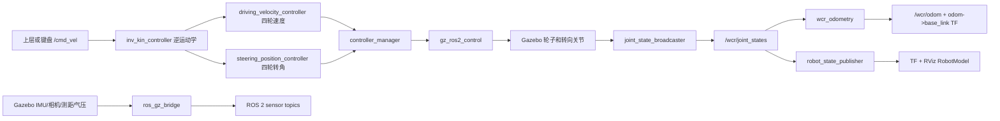
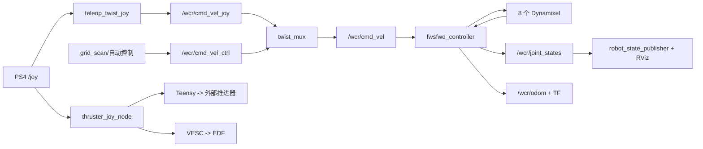
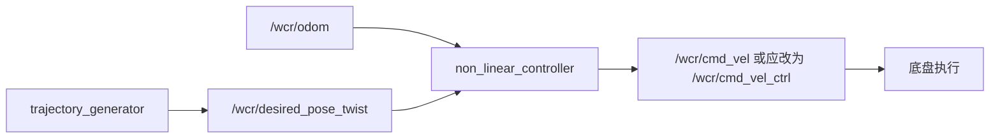

# WCR 两个 ROS 2 项目中文导读

> 对照项目：
>
> - <https://github.com/CRTA-Lab/wcr_gz>
> - <https://github.com/BCaran/wcr_stack>
>
> 本文依据 2026-08-04 的 GitHub README 和本地解压内容编写。重点不是逐字翻译代码，而是解释每类文件在机器人系统中的角色、两个仓库如何对应，以及阅读和实验时应从哪里入手。

## 1. 先用一句话理解两个仓库

- `wcr_gz-main`：机器人在 Gazebo Sim 中的“数字替身”，重点是模型、物理环境、仿真传感器、`ros2_control`、运动学控制和仿真里程计。
- `wcr_stack-jetson-nx-foxy`：机器人在 Jetson/真机上的“设备栈”，重点是 Dynamixel、VESC、Teensy、IMU、RealSense、手柄、定位与系统启动。

它们描述的是同一类 WCR（Wall Climbing Robot，爬壁机器人）：

- 4WIS：Four-Wheel Independent Steering，四轮独立转向。
- 4WID：Four-Wheel Independent Drive，四轮独立驱动。
- 四个轮子既能分别转向，也能分别控制转速，因此机器人可以前后走、横移、斜移和原地旋转。
- EDF（Electric Ducted Fan，涵道风扇）和外部推进器用于吸附/爬壁子系统。

最关键的对应关系是：

| 功能层 | Gazebo 仿真 | 真机 |
|---|---|---|
| 机器人身体 | URDF/Xacro + STL + SDF | 实际机械结构 |
| 轮子和转向电机 | Gazebo 关节 | Dynamixel 电机 |
| 电机接口 | `gz_ros2_control` | `fws_fwd_dxl` + Dynamixel Workbench |
| 环境 | `.sdf` world | 实际地面、斜坡或墙面 |
| IMU/相机/测距 | Gazebo sensor plugin | BNO055、RealSense T265 等 |
| 速度命令 | `geometry_msgs/Twist` | 同样是 `geometry_msgs/Twist` |
| 状态反馈 | 仿真关节状态 | 电机编码器和传感器 |
| 可视化 | RViz + Gazebo GUI | RViz + 真机话题 |

这就是 ROS 的优势：上层算法尽量使用相同的话题和消息，下层可以替换为仿真硬件或真实硬件。

## 2. ROS 2 系统中这些文件分别是什么

在看具体仓库前，先认识常见扩展名和目录。

| 文件/目录 | 用途 |
|---|---|
| `package.xml` | ROS 包清单：包名、版本、维护者、依赖、构建类型。`rosdep` 主要依据它安装依赖。 |
| `CMakeLists.txt` | C++/ament_cmake 包的构建规则：找依赖、编译节点、安装资源。 |
| `setup.py` | Python/ament_python 包的构建和安装规则，`console_scripts` 把 Python 函数注册成 `ros2 run` 可执行节点。 |
| `setup.cfg` | 告诉 setuptools 把脚本安装到 ROS 2 期望的 `lib/<package>` 目录。 |
| `resource/<包名>` | ament index 的包标记文件，让 ROS 2 能发现 Python 包。 |
| `launch/*.launch.py` | 一次启动多个 ROS 节点，也可包含其他 launch、加载参数和设置 remap。 |
| `config/*.yaml` | 节点参数、控制器配置、话题优先级、串口和传感器设置。 |
| `urdf/*.urdf` | 机器人 link/joint 树、外观、碰撞、惯性和传感器坐标系。 |
| `urdf/*.xacro` | 可参数化、可拆分复用的 URDF 模板，启动时展开成最终 URDF。 |
| `worlds/*.sdf` | Gazebo 世界：重力、物理引擎、地面、斜坡、灯光、模型和世界插件。 |
| `meshes/*.stl` | 机器人和场景的三维网格。URDF/SDF 引用它们显示外形或做碰撞。 |
| `rviz/*.rviz` | RViz 的保存布局，例如 Fixed Frame、RobotModel、TF、Image、LaserScan。 |
| `msg/*.msg` | 项目自定义 ROS 消息定义，构建后生成 C++/Python 类型。 |
| `src/*.cpp` | C++ ROS 节点源码。 |
| `<python_package>/*.py` | Python ROS 节点源码。 |
| `test/` | 单元测试、lint 或上游包的系统测试。 |
| `README.md` | 面向人的项目入口和运行说明，不参与运行。 |
| `LICENSE` | 代码许可证。 |
| `build/`、`install/`、`log/` | `colcon build` 产生的中间文件、安装结果和日志，不是源代码。 |
| `__pycache__/`、`*.pyc` | Python 自动生成的字节码缓存，可以忽略。 |

注意：你下载的 `wcr_stack` 中，`wcr_description/build` 也被包含进来了。这是之前某次构建留下的产物，不应当作为源码阅读，也不应复制到新工作空间。

## 3. `wcr_gz-main`：Gazebo 仿真仓库

### 3.1 五个 ROS 包的分工

```text
wcr_gz-main/
├── wcr_description   机器人模型、传感器、Gazebo 世界、RViz
├── wcr_control       启动 ros2_control 控制器
├── wcr_controllers   逆运动学和轨迹跟踪算法
├── wcr_odometry      根据轮速和转角计算里程计
└── wcr_launcher      总启动入口和集中参数
```

#### `wcr_launcher`

这是最先应该阅读的包，因为它是系统总入口。

- `launch/launcher.launch.py`
  - 启动 `robot_state_publisher`。
  - 条件启动 Gazebo。
  - 启动 `wcr_control` 中的控制器 spawner。
  - 启动 `wcr_controllers/inv_kin_controller`。
  - 启动 `wcr_odometry/odometry`。
  - 启动 rosbridge WebSocket 服务。
  - 根据参数选择是否启动 RViz。
- `config/launch_params.yaml`
  - 决定是否仿真、机器人命名空间、控制接口变体、世界文件、出生位置、是否启动 RViz、是否使用仿真时间。
  - 当前值是 `sim: true`、`variant: mock`、`namespace: wcr`、`world_file: ramp_world.sdf`。
- `config/robot_params.yaml`
  - 机器人的集中物理参数，包括 0.225 m 车长/车宽、质量、惯量、轮子参数、传感器安装位姿、噪声、更新率和推进器参数。
- `config/wcr_controller.yaml`
  - `controller_manager` 和四类控制器的配置。
  - `joint_state_broadcaster`：读全部关节状态并发布 `JointState`。
  - `driving_velocity_controller`：给四个车轮发送速度命令。
  - `steering_position_controller`：给四个转向关节发送位置命令。
  - `propeller_effort_controller`：给四个推进器和 EDF 关节发送 effort 命令。
- `config/bridge.yaml`
  - 指定 Gazebo Transport 与 ROS 2 之间要桥接的话题和消息类型。
  - 包括 `/clock`、IMU、相机、光流相机、测距和气压。
- `wcr_launcher/yaml_loader.py`
  - 读取两个 YAML。
  - 把 `robot_params.yaml` 中的值转换成 Xacro 参数。
  - 调用 `xacro` 生成 `robot_description`。

#### `wcr_description`

这是“机器人是什么样”的包。

- `urdf/wcr.urdf.xacro`
  - 总模型入口。
  - 包含公共材料/属性、参数、机器人主体。
  - `sim=true` 时包含 Gazebo 插件和仿真传感器。
  - 根据 `variant` 选择一种 `ros2_control` 硬件接口。
- `urdf/wcr_params.xacro`
  - 声明模型可接受的参数，并转成 Xacro property。
  - 可以把它理解成模型的“参数接口声明”。
- `urdf/wcr_common_properties.xacro`
  - 公共材料、颜色和可复用属性。
- `urdf/wcr_base.xacro`
  - 真正的 link/joint 树。
  - `base_link` 是机器人主坐标系。
  - `chassis_link` 是车体。
  - `FL/FR/BL/BR_steering` 是四个转向关节。
  - `FL/FR/BL/BR_wheel` 是四个驱动轮关节。
  - 还定义 IMU、T265、光流、气压计、测距、OptiTrack、Marvelmind、EDF 和推进器的 link/joint。
  - `visual` 决定看起来怎样，`collision` 决定碰撞形状，`inertial` 决定动力学响应。
- `urdf/wcr.gazebo`
  - 加入 `gz_ros2_control` 插件，让 Gazebo 关节成为 `ros2_control` 硬件。
  - 加入推进器系统插件。
  - 加入 IMU、相机、光流相机、气压计和单束 GPU lidar 传感器。
  - 设置传感器更新率、噪声和 Gazebo 话题。
- `urdf/mock_wcr_classic.ros2_control.xacro`
  - 当前 Gazebo 默认变体。
  - 四个轮子暴露 `velocity` command interface。
  - 四个转向关节暴露 `position` command interface。
  - 推进器暴露 `effort` command interface。
  - 虽然文件名叫 `mock`，实际插件是 `gz_ros2_control/GazeboSimSystem`，也就是 Gazebo 仿真硬件，而不是普通的 `mock_components/GenericSystem`。
- `urdf/wcr_classic.ros2_control.xacro`
  - 面向 Dynamixel 真硬件：轮速控制 + 转向位置控制。
- `urdf/wcr_effort.ros2_control.xacro`
  - 驱动和转向都按 effort/current 控制。
- `urdf/wcr_velocity.ros2_control.xacro`
  - 驱动和转向都按 velocity 控制。
- `urdf/wcr_mix.ros2_control.xacro`
  - 驱动 effort + 转向 position。
- `urdf/wcr_mimic.ros2_control.xacro`
  - 混合部分主控和跟随关节，用于某些简化/实验控制结构。
- `worlds/ramp_world.sdf`
  - 当前默认斜坡场景，使用 Bullet、重力和 ramp STL。
- `worlds/robot_world.sdf`
  - 简单地面世界，插件名称偏向较新的 `gz::sim` 命名。
- `worlds/wcr_depot.sdf`
  - 更复杂的 depot/仓库场景。
- `launch/gazebo.launch.py`
  - 调用 `ros_gz_sim/gz_sim.launch.py` 打开指定世界。
  - 从 `/<namespace>/robot_description` 把机器人 spawn 到世界。
  - 启动 `ros_gz_bridge/parameter_bridge`。
- `launch/display.launch.py`
  - 不需要真实物理仿真，只用 `joint_state_publisher_gui` 拖动关节，在 RViz 检查 URDF。
- `launch/rviz_sensors.launch.py`
  - 使用仿真时间打开 RobotModel 和传感器相关 RViz 配置。
- `env/prepare_envs.sh.in`
  - 把世界 mesh 目录加入 Gazebo 资源搜索路径，使 `model://ramp.stl` 能被找到。
- `meshes/`
  - 车架、轮组、EDF、推进器和斜坡的 STL 外形。
- `rviz/`
  - 保存 RViz 显示配置，不包含算法。

#### `wcr_control`

这个包不负责计算“机器人应该往哪里走”，而是负责加载底层关节控制器。

- `launch/controller.launch.py`
  - 使用 `controller_manager/spawner` 依次加载：
  - `joint_state_broadcaster`
  - `steering_position_controller`
  - `driving_velocity_controller`
  - `propeller_effort_controller`

在 Gazebo 模式下，`controller_manager` 本体不是这里显式启动的，而是由 URDF 中的 `gz_ros2_control` Gazebo 插件创建。这个 launch 只负责找它并加载控制器。

#### `wcr_controllers`

这是“如何把期望运动变成电机/关节命令”的算法包。

- `src/inv_kin_controller.cpp`
  - 最适合首先阅读。
  - 输入机器人机体速度 `Twist(vx, vy, wz)`。
  - 对第 i 个轮子计算：

```text
轮子局部 x 速度：vxi = vx - yi * wz
轮子局部 y 速度：vyi = vy + xi * wz
轮速：            wi  = sqrt(vxi^2 + vyi^2) / ri
转角：            di  = atan2(vyi, vxi)
```

  - 若转向角超过正负 90 度，则把轮速反向、转角减/加 180 度，减少舵机转动距离。
  - 输出四个轮速到 `driving_velocity_controller/commands`。
  - 输出四个转角到 `steering_position_controller/commands`。
- `src/trajectory_generator.cpp`
  - 生成 circle/eight/line 期望轨迹，使用 `nav_msgs/Odometry` 同时装期望位姿和速度。
- `src/model_based_controller.cpp`
  - 根据期望轨迹和实际里程计误差，直接产生四轮轮速与转角。
- `src/model_based_controller_velocity.cpp`
  - 带关节状态反馈的速度型模型控制器。
- `src/reduced_model_based_controller_velocity.cpp`
  - 降阶模型版本，减少模型状态/计算复杂度。
- `src/torque_model_based_controller.cpp`
  - 输出驱动和转向 torque/effort 的模型控制器。
- `src/simple_torque_model_based_controller.cpp`
  - 用内部简单轨迹测试 torque 控制和 PID/前馈效果。
- `src/mimic_help_controller.cpp`
  - 根据少数主关节状态给跟随关节产生命令。
- `CMakeLists.txt`
  - 把上述每个 `.cpp` 编译为可被 `ros2 run wcr_controllers <executable>` 启动的程序。

总启动文件当前只启动 `inv_kin_controller`，其余文件是研究/实验控制器，不会自动运行。

#### `wcr_odometry`

- `src/odometry.cpp`
  - 订阅四个轮子的角速度和四个舵角。
  - 用正运动学估算机器人机体的 `vx`、`vy` 和 `wz`。
  - 对速度积分得到 `x`、`y`、`yaw`。
  - 发布 `nav_msgs/Odometry` 和 `odom -> base_link` TF。
  - 提供 `reset_odometry` Trigger 服务清零积分。

它是轮式里程计，会因轮胎打滑、模型参数误差和数值积分不断漂移。Gazebo 中也应把它视为“算法估计”，而不是绝对真值。

### 3.2 仿真的完整数据流



`use_sim_time: true` 表示 ROS 节点使用 Gazebo 发布的 `/clock`，而不是电脑墙上时间。暂停仿真时，使用仿真时间的控制器和定时器也会随之暂停。

## 4. `wcr_stack-jetson-nx-foxy`：真机仓库

### 4.1 项目自研/集成包

```text
wcr_stack-jetson-nx-foxy/
├── fws_fwd_dxl              四轮独立转向/驱动的 Dynamixel 控制
├── wcr_description          较早期的真机 URDF 和 RViz
├── wcr_interfaces           自定义消息
├── wcr_system               系统总 launch、遥控和辅助算法
├── wcr_teensy               Teensy 串口通信
├── wcr_trajectory_generator 期望轨迹发生器
└── 大量第三方驱动/库
```

#### `fws_fwd_dxl`

- `src/fwsfwd_controller.cpp` 是真机底盘最核心的执行节点。
- 使用 `/dev/ttyUSB0`、3 Mbps 连接 8 个 Dynamixel：
  - ID 1-4：四个驱动轮，velocity mode。
  - ID 5-8：四个转向电机，position mode。
- 订阅 `/wcr/cmd_vel`，执行与仿真 `inv_kin_controller` 相似的逆运动学。
- 也订阅 `/wcr/joint_cmd`，允许控制器直接发送四轮线速度 + 四个转角。
- 周期读取电机位置、速度和电流，发布 `/wcr/joint_states`。
- 根据编码器做轮式里程计，发布 `/wcr/odom` 和 `odom -> base_link` TF。
- `config/fws_fwd_config.yaml` 保存 USB 口、轮子几何、电机速度限制、PID gain 和协方差。

因此，真机中的一个 `fwsfwd_controller` 同时承担了仿真仓库里三个模块的职责：

```text
inv_kin_controller + gz_ros2_control/电机硬件 + wcr_odometry
```

#### `wcr_description`

这是较早、较轻量的真机模型。

- `urdf/wcr.urdf.xacro`：总入口，仅包含 `wcr.xacro`。
- `urdf/wcr.xacro`：车架、轮子、转向和传感器 frame；主要用于 TF/RViz，没有完整 Gazebo 碰撞、惯性和传感器插件。
- `launch/display_dummy.launch.py`：用 GUI 人工发布关节状态，检查模型。
- `launch/display.launch.py`：真机运行时订阅 `/wcr/joint_states` 并显示实际姿态。
- `rviz/wcr.rviz`：真机 RViz 布局。

本地 `display_dummy.launch.py` 引用了不存在的 `rviz/wcr_dummy.rviz`，所以直接运行可能找不到配置；可以先显式改用现有 `wcr.rviz`。

#### `wcr_interfaces`

- `msg/DesiredPoseTwist.msg`：

```text
Header header
Pose pose
Twist twist
```

它在一条消息中同时表达“期望位姿”和“期望速度”，供轨迹发生器与轨迹跟踪控制器之间通信。

#### `wcr_trajectory_generator`

- `circle_node.py`：圆轨迹。
- `linear_node.py`：直线轨迹。
- `lissajous_node.py`：Lissajous 曲线轨迹。
- `square_wave_node.py`：方波/栅格式轨迹。
- 它们发布 `/wcr/desired_pose_twist`；部分节点还发布 `/wcr/desired_path` 给 RViz。
- `setup.py` 中的 `console_scripts` 决定对应的 `ros2 run` 名称。
- `config/trajectory_config.yaml` 当前没有被代码加载，而且键写成 `ros_parameters` 而不是 ROS 2 标准的 `ros__parameters`，现状更像未完成配置。

#### `wcr_system`

- `launch/system_floor.launch.py`
  - 启动 Dynamixel 底盘节点。
  - 启动 BNO055 IMU。
  - 启动 `robot_state_publisher`。
  - 启动 `twist_mux`。
  - 包含 RealSense T265 和 PS4 launch。
- `launch/subsystem_wall.launch.py`
  - 启动 Teensy 串口节点控制外部推进器。
  - 启动 VESC 控制 EDF。
- `launch/full_system.launch.py`
  - 基本等于 floor 系统再包含 wall 子系统。
- `launch/ps4.launch.py`
  - `joy_node` 读取 `/dev/input/js0`。
  - `teleop_twist_joy` 把手柄转换成 `/wcr/cmd_vel_joy`。
  - `thruster_joy_node` 同时处理吸附风扇/推进器按键。
- `config/wcr_twist_mux_topics.yaml`
  - 手柄 `/wcr/cmd_vel_joy` 优先级 255。
  - 自动控制 `/wcr/cmd_vel_ctrl` 优先级 100。
  - 输出统一 remap 到 `/wcr/cmd_vel`。
  - 这使手柄可以随时覆盖自动控制，是实际机器人常用的安全设计。
- `non_linear_controller.py`
  - 订阅 `/wcr/desired_pose_twist` 和 `/wcr/odom`。
  - 根据期望与实际位姿误差计算速度反馈。
  - 当前发布 `/wcr/cmd_vel`，会绕过 `twist_mux` 的 controller 输入；若希望保留手柄高优先级，应改发或 remap 到 `/wcr/cmd_vel_ctrl`。
- `grid_scan.py`
  - 生成网格扫描任务，使用里程计或 OptiTrack 反馈。
  - 发布 `/wcr/cmd_vel_ctrl`，与 `twist_mux` 的设计一致。
- `thruster_joy_node.py`
  - 从 `sensor_msgs/Joy` 读按键/方向键。
  - 发布 `/wcr/thruster/pwm` 给 Teensy。
  - 发布 `/wcr/edf/dutty_cycle` 给 VESC。`dutty` 是项目中沿用的拼写错误，remap 两端保持一致才能工作。
- `marvelmind_pose_cnv.py`
  - 把 Marvelmind 超声波定位消息转换为标准 `PoseStamped`。
- `optitrack_help.py`
  - OptiTrack 辅助节点，但 `setup.py` 注册的是不存在的 `optitrack_help_node.py` 模块名，运行前需要修正为实际模块。

#### `wcr_teensy`

- `teensy_serial_node.py`
  - 订阅 `/wcr/thruster/pwm`。
  - 通过 `/dev/ttyACM0`、9600 baud 发送 `THR<数值>\n` 给 Teensy。
  - Teensy 再控制推进器 ESC/PWM。

### 4.2 第三方包的用途

这些目录主要是项目为固定版本直接 vendoring 进来的上游依赖，不建议初学时逐行阅读。

| 目录 | 用途 |
|---|---|
| `bno055` | Bosch BNO055 IMU 驱动，发布姿态、角速度、加速度和磁场。 |
| `dynamixel-workbench` | ROBOTIS Dynamixel C++ 工具箱，封装 ping、模式切换、同步读写和单位换算。 |
| `dynamixel-workbench-msgs` | Dynamixel Workbench 使用的 ROS 消息/服务。 |
| `vesc` | VESC 电机控制器驱动和消息，这里用于 EDF。 |
| `realsense-ros-3.2.3` | Intel RealSense ROS 驱动；项目使用 T265 视觉里程计。T265 已停产，所以保留了较老版本。 |
| `robot_localization` | 标准 EKF/UKF 状态融合包，可融合轮式里程计、T265 和 IMU。 |
| `twist_mux`、`twist_mux_msgs` | 多路速度命令仲裁，按优先级选出唯一底盘命令。 |
| `marvelmind_ros2_upstream` | Marvelmind 室内定位驱动。 |
| `marvelmind_ros2_msgs_upstream` | Marvelmind 自定义消息。 |
| `transport_drivers` | ROS 通用串口/UDP/ASIO 通信基础库，供某些驱动使用。 |

`robot_localization/params/wcr_ekf.yaml` 的设计意图是：

- 轮式里程计提供 `vx`、`vy`、`wz`。
- T265 提供视觉速度/姿态信息。
- BNO055 提供 yaw、角速度和线加速度。
- EKF 输出更平滑、抗单一传感器缺陷的状态估计。

但当前 `system_floor.launch.py` 并没有启动这个 EKF；`wcr_ekf.launch.py` 还写死了 `/home/wcr/wcr_ws/...`，因此它是“已有配置但尚未完整接入总启动”的功能。

### 4.3 真机完整数据流



轨迹控制实验是另一条链：



## 5. 两个仓库怎样结合

### 5.1 不要直接放在同一个 `src` 一起构建

两个仓库都有同名 ROS 包 `wcr_description`。同一 colcon 工作空间中存在两个同名包会造成冲突，而且两个仓库面向的 ROS/Gazebo/硬件版本不同。

建议至少分成两个工作空间：

```text
~/wcr_sim_ws/src/       放 wcr_gz-main 的 5 个包
~/wcr_robot_ws/src/     放 wcr_stack 的真机包
```

在 Windows 主机上学习可使用 WSL2 + Ubuntu。ROS 2 Humble 的标准环境是 Ubuntu 22.04；Gazebo 版本必须和 `ros_gz`、`gz_ros2_control` 匹配。这个项目同时出现旧的 `ignition-*` 和新的 `gz-*` 插件命名，所以不能把 README 中的 Humble/Iron/Rolling 理解为所有组合都无需修改。

### 5.2 推荐的算法移植方式

不要先把整个真机仓库搬进仿真。优先搬运与硬件无关的三部分：

1. `wcr_interfaces`
2. `wcr_trajectory_generator`
3. `wcr_system/non_linear_controller.py`（最好拆成独立控制包）

目标仿真链路：

```text
trajectory_generator
  -> /wcr/desired_pose_twist
  -> non_linear_controller
  -> Twist
  -> inv_kin_controller
  -> ros2_control
  -> Gazebo
  -> joint_states
  -> wcr_odometry
  -> /wcr/odom
  -> non_linear_controller 反馈闭环
```

当前需要处理一个实际话题差异：

- 仿真 `inv_kin_controller` 被总 launch 启动时，虽然节点位于 `/wcr` namespace，但源码使用绝对话题，并且没有给 `robot_namespace` 参数赋值，所以实际输入是 `/cmd_vel`。
- 真机 `non_linear_controller` 输出的是 `/wcr/cmd_vel`。

可以暂时 remap：

```bash
ros2 run wcr_system non_linear_controller --ros-args -r /wcr/cmd_vel:=/cmd_vel
```

长期更合理的做法是统一所有节点的话题命名策略：使用相对话题配合 namespace，或统一使用 `/wcr/...`，不要混用。

## 6. 当前代码中值得提前知道的问题

这些不代表项目“没有用”，而是研究代码常见的版本演化痕迹。

1. `wcr_stack` 默认分支名是 `jetson-nx-foxy`，但当前 README 的真机安装命令让用户克隆 `humble` 分支。你本地这份不能自动视为 Humble 完整兼容。
2. `wcr_stack` 的 launch 多处写死 `/home/wcr/wcr_ws/src/...`，换用户名或工作空间后就会失败。应改用 `get_package_share_directory()` 或 package share path。
3. RealSense T265 launch 依赖仓库内旧版驱动和特定文件名，现代系统上需要核对 API/launch 名称。
4. `wcr_gz` 的 `ramp_world.sdf`、`wcr_depot.sdf` 使用较旧的 `ignition::gazebo` 名称，而 `robot_world.sdf` 使用较新的 `gz::sim` 名称。选择 Gazebo 版本时需保持一致。
5. `wcr_gz` 的 `package.xml` 依赖声明不完整；CMake 能找到的依赖不等于 `rosdep` 一定能从清单安装齐。
6. `wcr_launcher` 总 launch 无条件启动 `rosbridge_server`，没安装 rosbridge 时整个启动会报包找不到。
7. `launch_params.yaml` 中 `use_controllers`/`controller` 的读取属性没有真正用于条件启动控制器。
8. `propeller_control` 参数被传入 Xacro，但当前 `wcr.gazebo` 没用它包住推进器插件；开关目前没有实际关闭插件的效果。
9. Gazebo 推进器插件与 `propeller_effort_controller` 是否使用同一命令通道需要单独验证，不能仅凭关节会旋转就认定推力物理已正确施加。
10. 真机控制器和仿真里程计都会发布 `odom -> base_link`。以后接 EKF 时只能让一个节点负责该 TF，否则会发生 TF authority 冲突。
11. 真机总启动没有包含 EKF、轨迹发生器和非线性控制器；这些是可选实验功能，需要单独启动和 remap。
12. 项目中的 `dutty_cycle` 拼写虽错误，但发送端和 remap 端一致。修改时必须两端一起改。
13. `wcr.gazebo` 使用 `thrust_coefficient_edf`、`max_thrust_cmd_edf`、`thrust_coefficient_propeller` 和 `max_thrust_cmd_propeller`，但 `wcr_params.xacro` 没为它们声明默认 `xacro:arg`。总启动会从 `robot_params.yaml` 传入这些值；单独运行 `display.launch.py` 或 `rviz_sensors.launch.py` 时则可能在 Xacro 展开阶段报未定义参数。纯 RViz 显示时应传 `sim:=false`，或者为这四个参数补默认声明。

## 7. 建议的阅读与实验顺序

### 阶段一：只理解机器人模型

1. 看 `wcr_gz-main/wcr_description/urdf/wcr.urdf.xacro` 的 include 关系。
2. 看 `wcr_base.xacro` 中一个轮组，例如 `FL_steering -> FL_wheel`。
3. 对照 `meshes/` 理解 link、joint 与 STL 的区别。
4. 用 `display.launch.py` 在 RViz 拖动四个转角，观察 TF 树。

此阶段不要急着看模型控制器或硬件驱动。

### 阶段二：理解 Gazebo 与 ROS 如何连接

1. 看 `launch_params.yaml` 选择的 world 和 variant。
2. 看 `launcher.launch.py` 的启动顺序。
3. 看 `wcr.gazebo` 中的 `gz_ros2_control` 和 sensor。
4. 看 `wcr_controller.yaml` 中 controller 名称、joint 列表和 interface 类型。
5. 看 `bridge.yaml` 对照 Gazebo 消息与 ROS 消息。

### 阶段三：让机器人按速度运动

1. 阅读 `inv_kin_controller.cpp`。
2. 给 `/cmd_vel` 发布 `Twist`。
3. 同时观察控制器命令、`/wcr/joint_states` 和 `/wcr/odom`。
4. 分别测试前进、横移和原地旋转，验证四个轮子的角度/转速是否符合直觉。

典型测试命令：

```bash
# 前进
ros2 topic pub --rate 10 /cmd_vel geometry_msgs/msg/Twist \
  "{linear: {x: 0.10, y: 0.0, z: 0.0}, angular: {x: 0.0, y: 0.0, z: 0.0}}"

# 横移
ros2 topic pub --rate 10 /cmd_vel geometry_msgs/msg/Twist \
  "{linear: {x: 0.0, y: 0.10, z: 0.0}, angular: {x: 0.0, y: 0.0, z: 0.0}}"

# 原地旋转
ros2 topic pub --rate 10 /cmd_vel geometry_msgs/msg/Twist \
  "{linear: {x: 0.0, y: 0.0, z: 0.0}, angular: {x: 0.0, y: 0.0, z: 0.30}}"
```

测试结束应发布零速度或停止持续 publisher。

### 阶段四：理解反馈与闭环控制

1. 阅读 `wcr_odometry/src/odometry.cpp`，理解正运动学与积分。
2. 阅读 `DesiredPoseTwist.msg` 和一个轨迹发生器。
3. 阅读 `non_linear_controller.py` 如何计算位姿误差。
4. 把 `/wcr/cmd_vel` remap 到仿真的 `/cmd_vel`，形成闭环。
5. 在 RViz 同时画期望路径和实际 odom，观察跟踪误差。

### 阶段五：再看真机硬件

1. `fwsfwd_controller.cpp`：Dynamixel 模式、ID、同步读写、单位换算。
2. `ps4.launch.py` + `twist_mux`：人工和自动命令仲裁。
3. BNO055、T265、`robot_localization`：状态估计。
4. Teensy、VESC、EDF：爬壁吸附子系统。

在没有真实硬件时，不要直接运行 `system_floor.launch.py` 或 `subsystem_wall.launch.py`。它们会访问 `/dev/ttyUSB0`、`/dev/ttyACM0`、`/dev/ttyTHS0`、I2C bus 8 和 `/dev/input/js0`。

## 8. 运行时最有用的 ROS 2 观察命令

```bash
# 当前有哪些节点、话题、服务
ros2 node list
ros2 topic list -t
ros2 service list

# 看一个节点订阅/发布了什么
ros2 node info /wcr/inv_kin_controller

# 看消息结构
ros2 interface show geometry_msgs/msg/Twist
ros2 interface show sensor_msgs/msg/JointState
ros2 interface show nav_msgs/msg/Odometry

# 查看数据
ros2 topic echo /wcr/joint_states
ros2 topic echo /wcr/odom
ros2 topic hz /wcr/joint_states

# 查看 ros2_control 状态
ros2 control list_controllers -c /wcr/controller_manager
ros2 control list_hardware_interfaces -c /wcr/controller_manager

# 清零仿真里程计（名称以实际 service list 为准）
ros2 service call /wcr/reset_odometry std_srvs/srv/Trigger "{}"

# 检查 TF
ros2 run tf2_ros tf2_echo odom base_link
```

遇到“机器人显示但不动”，按以下顺序查：

```text
/cmd_vel 是否有数据
-> inv_kin_controller 是否收到
-> 两个 controller/commands 是否有数据
-> controller 是否 active
-> hardware interface 是否 claimed
-> /wcr/joint_states 是否变化
-> Gazebo 是否暂停、/clock 是否运行
```

遇到“Gazebo 有传感器但 ROS 看不到”，查：

```text
gz topic -l
-> bridge.yaml 的 Gazebo topic 名是否一致
-> ros_gz_bridge 是否在运行
-> ROS 消息类型与 Gazebo 消息类型是否匹配
-> namespace 后最终 ROS topic 到底是什么
```

## 9. 最后建立一个正确的心智模型

不要把 ROS 2 项目理解成“一个主程序调用很多函数”。它更像一组同时运行、通过消息互相连接的小程序：

- URDF/Xacro 定义身体和坐标系。
- Gazebo/SDF 定义世界和物理规律。
- launch 决定哪些程序同时启动。
- YAML 决定程序以什么参数运行。
- topic 传连续数据。
- service 执行一次性请求。
- TF 描述各坐标系之间的关系。
- controller 把运动目标变成关节命令。
- hardware interface 把关节命令交给 Gazebo 或真实电机。
- odometry/定位算法把传感器反馈变成机器人状态。
- RViz 只负责观察 ROS 数据，Gazebo 才负责物理仿真。

理解这条链以后，两个仓库里看似很多的文件会自然分成“描述、启动、配置、算法、驱动、可视化、依赖”七类，不再是一堆互不相关的目录。
